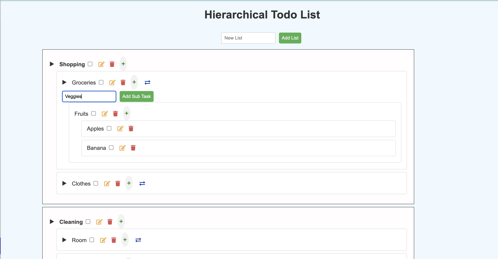
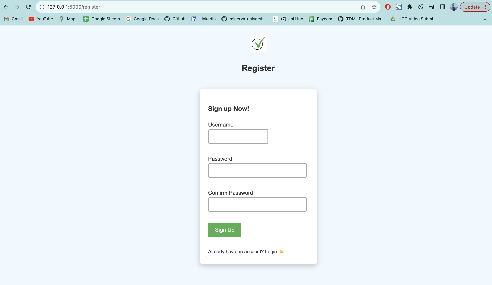
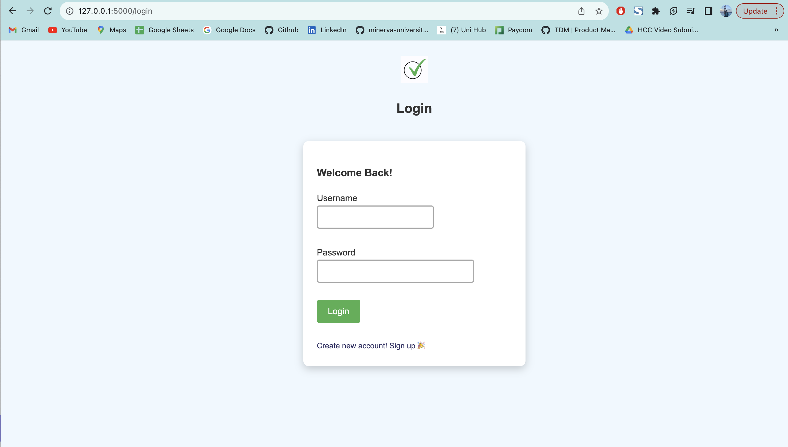

# Hierarchical Todo List App 

Technologies and Frameworks Used: Python, Flask, SQL, WTForms, HTML, CSS


### Features:
- [x] User Authentication 
- [x] CRUD features 
- [x] Hierarchy
- [x] Move Top Level Tasks to different lists 
- [x] Toggle - Show/Hide Lists and tasks 


## Run locally on MacOS

```
python3 -m venv venv
source venv/bin/activate
pip3 install -r requirements.txt
python3 app.py
```
Open http://127.0.0.1:5000/ in browser


### Demo:
 https://www.loom.com/share/b2270d79d12a419ca10abe619bf0130d?sid=e407cd16-6b91-4b17-8427-85b9530136c6

# UI Screenshots

## Loaded Hierarchical Todo List 

  


## Signup - Create a new account


## Login to existing account



